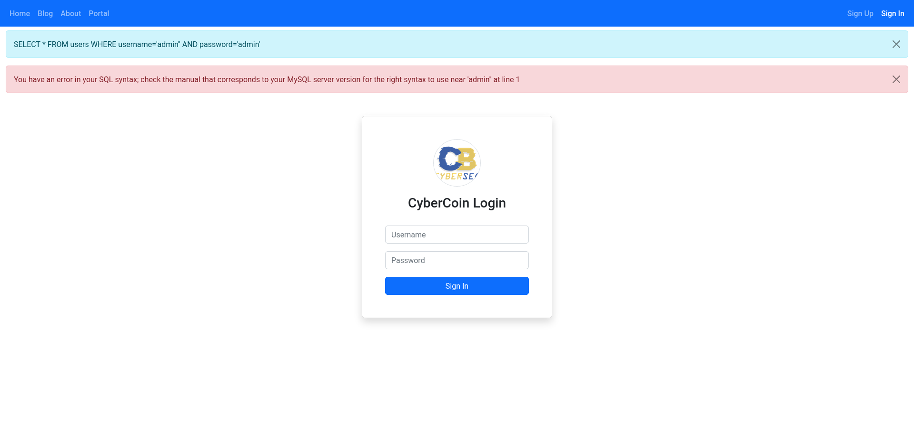

# SQLi Lab
SQL injection lab built to demonstrate and teach the basics of SQL injection attacks.

## Requirements
- `docker`
- `docker-compose`

## Installation
```
sudo apt install -y docker docker-compose git
git clone https://github.com/milesrack/sqli-lab.git
cd sqli-lab/
sudo docker-compose build
```

## Usage
To start the container:
```
sudo docker-compose up
```
To stop the container:
```
sudo docker-compose down
```
